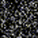
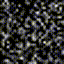
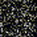
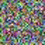
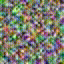
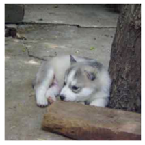
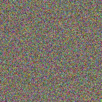
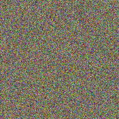

# Dropout is NOT All You Need to Prevent Gradient Leakage
This repository contains the implementation of our proposed Dropout Inversion Attack (DIA).
For a demonstration of our attack follow the DIA_demo jupyter notebook.

The paper including all empirical results can be found on [arXiv](https://arxiv.org/abs/2208.06163)

## Example reconstructions for different attacks, dropout rates and datasets on a ViT [2]
| | Original| IG [1]                                      | IG [1]                                     | DIA (Ours)                                       |
|:-:|:------:|:---------------------------------------:|:---------------------------------------:|:-----------------------------------------:|
|Dropout Rate p| - | p=0.00                                  | p=0.10                                  | p=0.10                                    |
|MNIST   |  |  |  |  |
|CIFAR-10|  |  |  |  |
|ImageNet|  |  |  |  |

## Please cite as:
```
@misc{https://doi.org/10.48550/arxiv.2208.06163,
  doi = {10.48550/ARXIV.2208.06163},  
  url = {https://arxiv.org/abs/2208.06163},
  author = {Scheliga, Daniel and Mäder, Patrick and Seeland, Marco},
  title = {Dropout is NOT All You Need to Prevent Gradient Leakage},
  publisher = {arXiv},
  year = {2022}
}
```

## Abstract:
Gradient inversion attacks on federated learning systems reconstruct client training data from exchanged gradient information. To defend against such attacks, a variety of defense mechanisms were proposed. However, they usually lead to an unacceptable trade-off between privacy and model utility. Recent observations suggest that dropout could mitigate gradient leakage and improve model utility if added to neural networks. Unfortunately, this phenomenon has not been systematically researched yet. In this work, we thoroughly analyze the effect of dropout on iterative gradient inversion attacks. We find that state of the art attacks are not able to reconstruct the client data due to the stochasticity induced by dropout during model training. Nonetheless, we argue that dropout does not offer reliable protection if the dropout induced stochasticity is adequately modeled during attack optimization. Consequently, we propose a novel Dropout Inversion Attack (DIA) that jointly optimizes for client data and dropout masks to approximate the stochastic client model. We conduct an extensive systematic evaluation of our attack on four seminal model architectures and three image classification datasets of increasing complexity. We find that our proposed attack bypasses the protection seemingly induced by dropout and reconstructs client data with high fidelity. Our work demonstrates that privacy inducing changes to model architectures alone cannot be assumed to reliably protect from gradient leakage and therefore should be combined with complementary defense mechanisms.

## Requirements:
+ matplotlib
+ munch
+ pyyaml
+ numpy
+ pytorch
+ einops

You can also use [conda](https://www.anaconda.com/) to recreate our virtual environment:
```
conda env create -f environment.yaml
conda activate DIA
```

## Credits:
We base our implementation on the following repositories:
+ [1] [GitHub](https://github.com/JonasGeiping/invertinggradients) for the implementation of [IG](https://arxiv.org/abs/2003.14053)
+ [2] [GitHub](https://github.com/lucidrains/vit-pytorch/blob/main/vit_pytorch/vit.py) for the implementation of the VisionTransformer